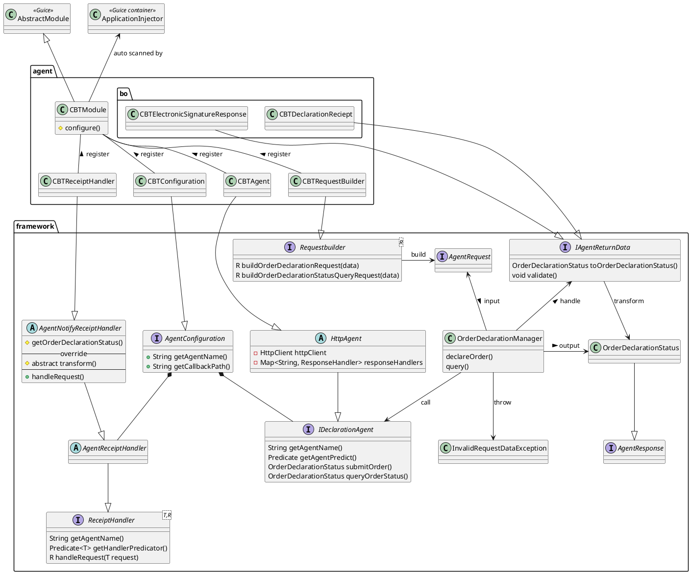

```plantuml
@startuml

namespace framework{
    interface AgentConfiguration{
        + String getAgentName()
        + String getCallbackPath()
    }


    interface IDeclarationAgent{
        String getAgentName()
        Predicate getAgentPredict()
        OrderDeclarationStatus submitOrder()
        OrderDeclarationStatus queryOrderStatus()
    }

    interface Requestbuilder<R> {
        R buildOrderDeclarationRequest(data)
        R buildOrderDeclarationStatusQueryRequest(data)
    }


    interface ReceiptHandler<T,R>{
        String getAgentName()
        Predicate<T> getHandlerPredicator()
        R handleRequest(T request)
    }


    interface IAgentReturnData{
        OrderDeclarationStatus toOrderDeclarationStatus()
        void validate()
    }

    interface AgentResponse
    interface AgentRequest


    abstract class HttpAgent{
        - HttpClient httpClient
        - Map<String, ResponseHandler> responseHandlers

    }

    abstract class AgentReceiptHandler{

    }

    abstract class AgentNotifyReceiptHandler{
        # getOrderDeclarationStatus()
--override--
        # abstract transform()
----
        + handleRequest()
    }

    class OrderDeclarationStatus

    class InvalidRequestDataException {

    }

    class OrderDeclarationManager{
        declareOrder()
        query()
    }

    IDeclarationAgent <|-up- HttpAgent
    ReceiptHandler <|-up-AgentReceiptHandler
    AgentNotifyReceiptHandler--|>AgentReceiptHandler

    AgentConfiguration *-- IDeclarationAgent
    AgentConfiguration *-- AgentReceiptHandler

    OrderDeclarationStatus -down-|>AgentResponse

    OrderDeclarationManager-->IDeclarationAgent : call
    OrderDeclarationManager-up-> IAgentReturnData :> handle
    OrderDeclarationManager-up-> AgentRequest :< input
    OrderDeclarationManager-right-> OrderDeclarationStatus :> output
    IAgentReturnData-down->OrderDeclarationStatus: transform

    OrderDeclarationManager-->InvalidRequestDataException : throw
    Requestbuilder-right->AgentRequest:build
}

namespace agent {
    namespace bo{
        class CBTElectronicSignatureResponse
        class CBTDeclarationReciept

        CBTElectronicSignatureResponse --|> framework.IAgentReturnData
        CBTDeclarationReciept --|>framework.IAgentReturnData
    }
    class CBTModule {
        # configure()
    }
    class CBTRequestBuilder{

    }
    class CBTReceiptHandler
    class CBTAgent{

    }

    class CBTConfiguration

    CBTAgent--|> framework.HttpAgent    
    CBTRequestBuilder--|>framework.Requestbuilder
    CBTReceiptHandler--|>framework.AgentNotifyReceiptHandler
    CBTConfiguration --|>framework.AgentConfiguration

    CBTRequestBuilder-up-CBTModule :> register
    CBTReceiptHandler-up-CBTModule:> register
    CBTConfiguration-up-CBTModule:> register
    CBTAgent-up-CBTModule:> register
}

class ApplicationInjector <<Guice container>>
class AbstractModule <<Guice>>

agent.CBTModule -up-> ApplicationInjector : auto scanned by
agent.CBTModule -up-|> AbstractModule


@enduml
```