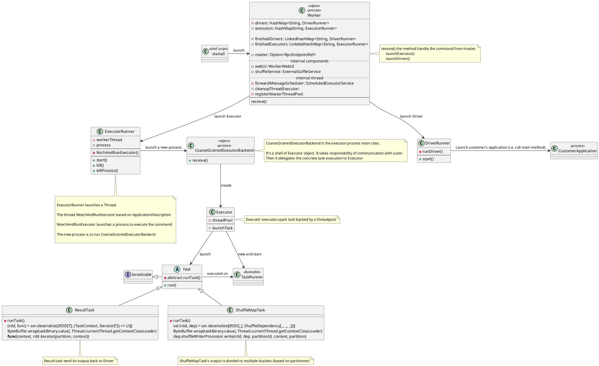

### Worker's process under standalone cluster manager.

```plantuml
@startuml

class CustomerApplication <<process>>{

}

interface Serializable{

}

class startall <<shell script>>{
}

class Worker <<object>> <<process>> {
	- drivers: HashMap<String, DriverRunner>
    - executors: HashMapString, ExecutorRunner>

    - finishedDrivers: LinkedHashMap<String, DriverRunner>
    - finishedExecutors: LinkdedHashMap<String, ExecutorRunner>

    - master: Option<RpcEndpointRef>
.. internal components ..
    - webUi: WorkerWebUI
    - shuffleService: ExternalSuffleService
.. internal thread ..
    - forwardMessageScheduler: ScheduledExecutorService
    - cleanupThreadExecutor:
    - registerMasterThreadPool
--
	receive()
}

class DriverRunner{
   - runDriver()
--
   + start()
}

class ExecutorRunner{
 - workerThread
 - process
--
 - fetchAndRunExecutor()
--
 + start()
 + kill()
 + killProcess()
}

class CoarseGrainedExecutorBackend <<object>> <<process>>{
 + receive()
}

class Executor{
	- threadPool
--
    + launchTask
}


class TaskRunner <<Runnable>>{
}

abstract class Task{
    - abstract runTask()
--
    + run()
}
class ShuffleMapTask{
    -  runTask()
     val (rdd, dep) = ser.deserialize[(RDD[_], ShuffleDependency[_, _, _])](
      ByteBuffer.wrap(taskBinary.value), Thread.currentThread.getContextClassLoader)
    dep.shuffleWriterProcessor.write(rdd, dep, partitionId, context, partition)
}
class ResultTask{
    - runTask()
       (rdd, func) = ser.deserialize[(RDD[T], (TaskContext, Iterator[T]) => U)](
      ByteBuffer.wrap(taskBinary.value), Thread.currentThread.getContextClassLoader)
      <b>func</b>(context, rdd.iterator(partition, context))
}

note as N1
   receive() the method handle the command from master.
        launchExecutor()
        launchDriver()
end note

note as N2

ExecutorRunner launches a Thread.

The thread fetechAndRunExecutor based on ApplicationDescription

fetechAndRunExecutor launches a process to execute the command

The new process is to run CoarseGrainedExecutorBackend

end note

note as N3
CoarseGrainedExecutorBackend is the executor process main class.

It's a shell of Executor object. It takes responsibility of communication with outer.
Then it delegates the concrete task execution to Executor
end note

note as N4
Executor executes spark task backed by a threadpool
end note

note as N5
ShuffleMapTask's output is divided to multiple buckets (based on partitioner)
end note

note as N6
Result task send its output back to Driver
end note

N1 .left. Worker
N2 .up. ExecutorRunner
N3 .left. CoarseGrainedExecutorBackend
N4 .left. Executor
N5 .up. ShuffleMapTask
N6 .up. ResultTask

Serializable <|-right-Task
startall -right-> Worker : launch

Worker -->DriverRunner : launch Driver
Worker -->ExecutorRunner : launch Executor

DriverRunner -right->CustomerApplication : Launch customer's application (i.e. call main method)

ExecutorRunner -right-> CoarseGrainedExecutorBackend : launch a new process

CoarseGrainedExecutorBackend --> Executor: create

Executor-down->Task: launch
Executor-right->TaskRunner: new and start

Task -right-> TaskRunner : executed on

ShuffleMapTask -up-|>Task
ResultTask -up-|>Task


@enduml
```